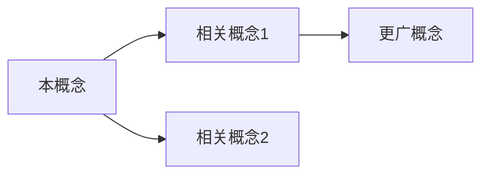

# [概念名称]

> 一句话定义这个概念

## 定义

(概念的核心定义)

## 核心要点

- 要点 1
- 要点 2
- 要点 3

## 应用场景

- 场景 1
- 场景 2

## 与其他概念的关系

```mermaid
graph LR
    A[本概念] --> B[相关概念1]
    A --> C[相关概念2]
    B --> D[更广概念]
```

## 相关概念

- [[概念1]]
- [[概念2]]

## 相关实体

- [[实体1]]
