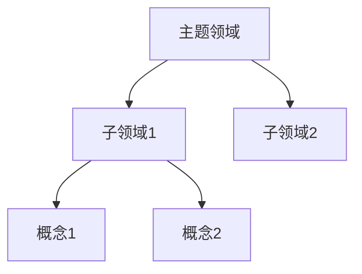

# 概览: [主题领域]

> 一句话概括这个领域

## 领域定义

(这个领域的核心定义和范围)

## 核心概念

| 概念 | 描述 | 详情页 |
|------|------|--------|
| 概念1 | 简述 | [[概念1]] |
| 概念2 | 简述 | [[概念2]] |

## 核心实体

| 实体 | 类型 | 描述 |
|------|------|------|
| 实体1 | 类型 | [[实体1]] |

## 知识图谱

## 学习路径

1. 先了解 [[概念1]]
2. 再学习 [[概念2]]
3. 深入研究 [[概念3]]

## 相关概览

- [[相关领域1]]
- [[相关领域2]]
